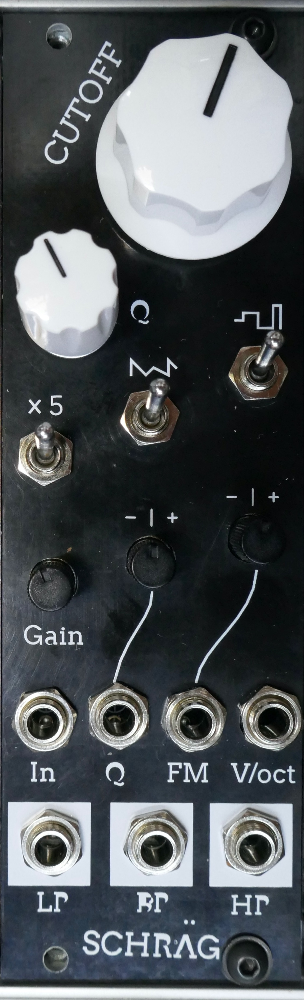

# Schräg

Schräg is an 8HP multimode filter module for the eurorack format, based off the [Bastl Cinnamon](https://bastl-instruments.com/eurorack/modules/cinnamon).

## LARGE WARNING AND DISCLAIMER!

The current version of the schematic and board files are **UNTESTED**. I ordered a run of the first revision of my board and built one module, then corrected the various small issues from the initial design in the current files. The DRC passes, but I **HAVE NOT ORDERED OR BUILT THE CURRENT VERSION OF THE BOARDS** so cannot guarantee that they work.

This disclaimer will be removed or updated when I or someone else successfully builds a Schräg based on the new board layout. Please let me know if you do so!

## Quick links

* [Schematic](Schraeg/Schraeg.pdf)
* [Gerbers](Schraeg/output)
* [BOM](Schraeg/Schraeg%20BOM.csv)

## Features

Schräg is effectively a repackaged Bastl Cinnamon:

* Multimode filter with independent outputs (2-pole LP, 2-pole HP, 1-pole BP)
* V/oct input
* Self resonates for use as a sine oscillator
* Input with an attenuator and +5dB gain switch
* Two character switches for altering the resonance tracking
* All-SMD construction in a DIY-friendly format, with 0603 handsoldering footprints, all components on the back of the circuit board
* Built mostly using standard and easily-available components

with a few modifications:

* larger 8HP form factor, allowing for a big juicy cutoff knob
* Voltage control over resonance, through an attenuverter
* FM input through an attenuverter, which works as a pitch fine-tune control with nothing patched
* Larger character and gain switches
* A bi-directional power connector, with polyfuses
* An Interactive BOM (`Schraeg/Output/Interactive BOM.html` once you’ve cloned the repo locally) to aid in part placement

The additional functionality is achieved with a minimum of extra components, thanks to the two unused VCA cells in the original design.

## License

The schematic, board layout and graphics are released under a cc-by-sa license. [Bastl Instruments](https://bastl-instruments.com/) generously gave their permission for me to release my rework of their module. They’re a cool company. Go check out their work!

## Development

In 2019 I was looking through the [Bastl Cinnamon schematic](https://github.com/bastl-instruments/bastlSchematics/blob/master/CINNAMON_V1.2.pdf) and realised that it only uses two of the four available V2164D VCA cells.

At the time I needed PCB layout practise (and a filter module for my DIY eurorack!), so I ended up prototyping and building an 8HP version of cinnamon for myself which uses the two spare cells to implement voltage control over resonance, as well as a few other little additions listed above.

I called it “Schräg” because of both the angled panel design, the weird sounds possible with your cool distortion circuits, and the strange way KiCAD mangled the panel graphics.